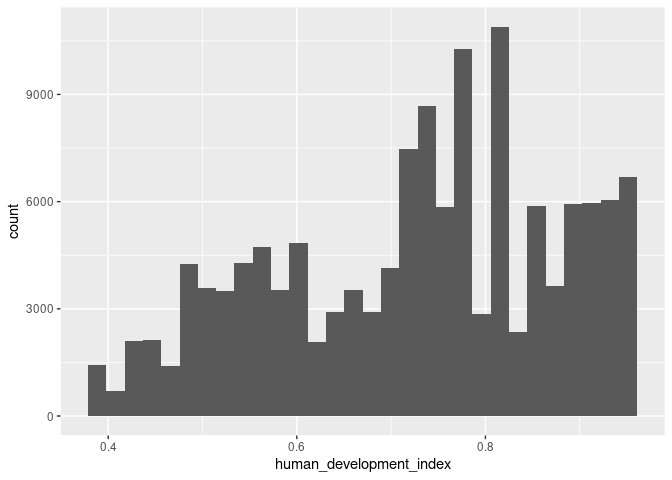
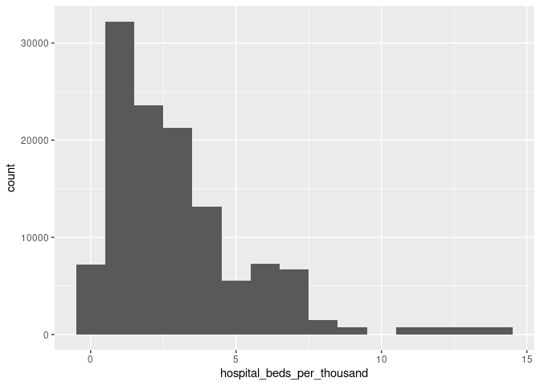
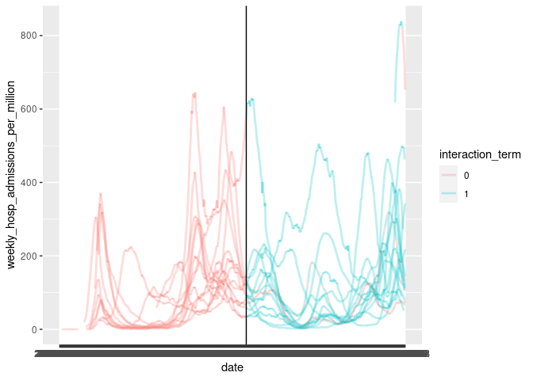
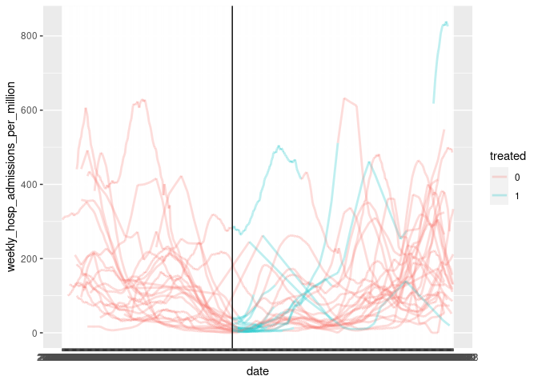
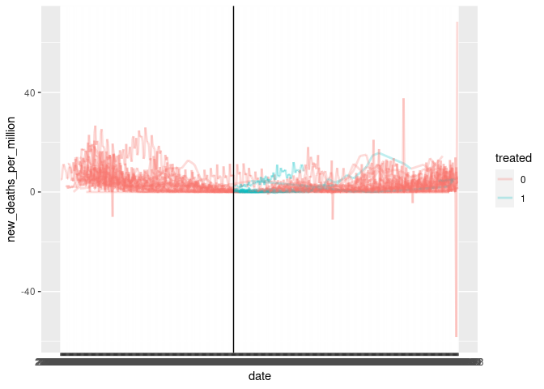
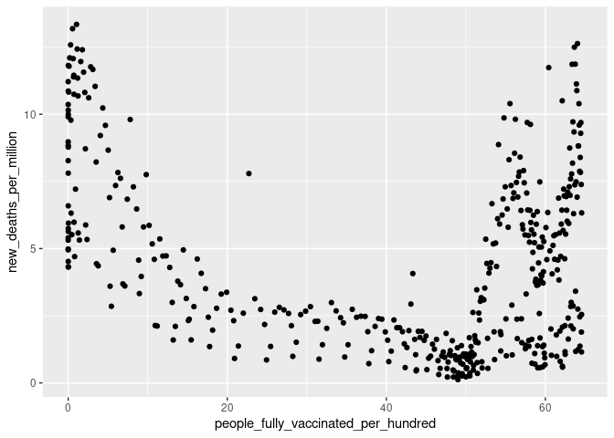
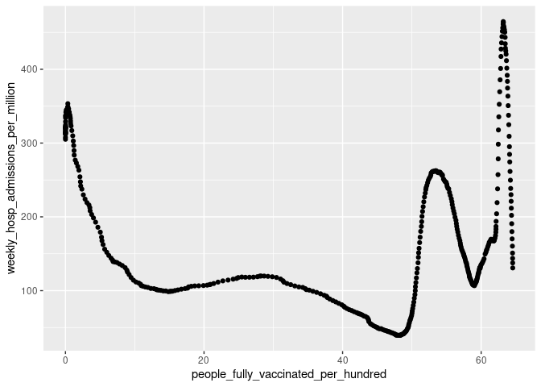
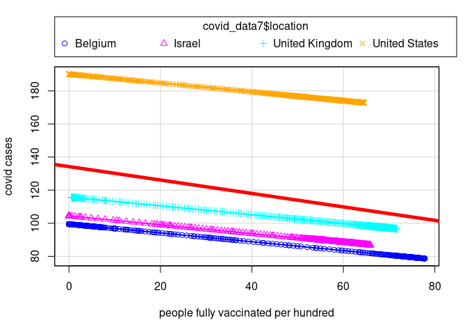

Project proposal
================
Chrissy & Ricky

``` r
library(tidyverse)
library(gganimate)
library(foreign)
library(readr)
library(broom)
library(fivethirtyeight)
library(WDI)
library("sf")
library("rnaturalearth")
library("rnaturalearthdata")
library(rgeos)
```

## 0. Requirements

You will write your proposal in the proposal.Rmd file in your Github
project.

Section 1 - Introduction: The introduction should introduce your general
research question and your data (where it came from, how it was
collected, what are the cases, what are the variables, etc.).

Section 2 - Data: Place your data in the /data folder, and add
dimensions and codebook to the README in that folder. Then print out the
output of glimpse() or skim() of your data frame.

Section 3 - Data analysis plan:

1.  The outcome (response, Y) and predictor (explanatory, X) variables
    you will use to answer your question. The comparison groups you will
    use, if applicable.

2.  Very preliminary exploratory data analysis, including some summary
    statistics and visualizations, along with some explanation on how
    they help you learn more about your data. (You can add to these
    later as you work on your project.)

3.  The statistical method(s) that you believe will be useful in
    answering your question(s). (You can update these later as you work
    on your project.) What results from these specific statistical
    methods are needed to support your hypothesized answer?

Finally, each section should be no more than 1 page (excluding figures).
You can check a print preview to confirm length.

## 1. Introduction

Section 1 - Introduction: The introduction should introduce your general
research question and your data (where it came from, how it was
collected, what are the cases, what are the variables, etc.).

1.  We intend on using covid and world indicators to examine what cause
    differences in how different countries experienced the pandemic/
    what might have caused different pandemic outcomes across the world
    (in terms of covid cases and deaths).

We will use data from two sources: (1) Covid-19 related data (owid-covid
data), which includes general covid cases and deaths information from
JHU, some variables from World Bank Development Indicators (such as
population density, GDP per capita), and some variables from CDC (such
as ICU beds), (2) World Bank World Development Indicator. Covid-related
data is coming from this repo:
<https://github.com/owid/covid-19-data.git>; WDI is coming from the WDI
package in R. The owid-covid-data should be sufficient for our analysis,
but we may need additional data from WDI, so we include WDI here in case
we may need it in the future.

## 2. Data

Section 2 - Data: Place your data in the /data folder, and add
dimensions and codebook to the README in that folder. Then print out the
output of glimpse() or skim() of your data frame.

``` r
covid_data <- readr::read_csv(file = "../data/owid-covid-data.csv")
```

    ## Rows: 164243 Columns: 67

    ## ── Column specification ────────────────────────────────────────────────────────
    ## Delimiter: ","
    ## chr   (4): iso_code, continent, location, tests_units
    ## dbl  (62): total_cases, new_cases, new_cases_smoothed, total_deaths, new_dea...
    ## date  (1): date

    ## 
    ## ℹ Use `spec()` to retrieve the full column specification for this data.
    ## ℹ Specify the column types or set `show_col_types = FALSE` to quiet this message.

``` r
covid_data_code <- readr::read_csv(file = "../data/owid-covid-codebook.csv")
```

    ## Rows: 67 Columns: 4

    ## ── Column specification ────────────────────────────────────────────────────────
    ## Delimiter: ","
    ## chr (4): column, source, category, description

    ## 
    ## ℹ Use `spec()` to retrieve the full column specification for this data.
    ## ℹ Specify the column types or set `show_col_types = FALSE` to quiet this message.

``` r
glimpse(covid_data)
```

    ## Rows: 164,243
    ## Columns: 67
    ## $ iso_code                                   <chr> "AFG", "AFG", "AFG", "AFG",…
    ## $ continent                                  <chr> "Asia", "Asia", "Asia", "As…
    ## $ location                                   <chr> "Afghanistan", "Afghanistan…
    ## $ date                                       <date> 2020-02-24, 2020-02-25, 20…
    ## $ total_cases                                <dbl> 5, 5, 5, 5, 5, 5, 5, 5, 5, …
    ## $ new_cases                                  <dbl> 5, 0, 0, 0, 0, 0, 0, 0, 0, …
    ## $ new_cases_smoothed                         <dbl> NA, NA, NA, NA, NA, 0.714, …
    ## $ total_deaths                               <dbl> NA, NA, NA, NA, NA, NA, NA,…
    ## $ new_deaths                                 <dbl> NA, NA, NA, NA, NA, NA, NA,…
    ## $ new_deaths_smoothed                        <dbl> NA, NA, NA, NA, NA, NA, NA,…
    ## $ total_cases_per_million                    <dbl> 0.126, 0.126, 0.126, 0.126,…
    ## $ new_cases_per_million                      <dbl> 0.126, 0.000, 0.000, 0.000,…
    ## $ new_cases_smoothed_per_million             <dbl> NA, NA, NA, NA, NA, 0.018, …
    ## $ total_deaths_per_million                   <dbl> NA, NA, NA, NA, NA, NA, NA,…
    ## $ new_deaths_per_million                     <dbl> NA, NA, NA, NA, NA, NA, NA,…
    ## $ new_deaths_smoothed_per_million            <dbl> NA, NA, NA, NA, NA, NA, NA,…
    ## $ reproduction_rate                          <dbl> NA, NA, NA, NA, NA, NA, NA,…
    ## $ icu_patients                               <dbl> NA, NA, NA, NA, NA, NA, NA,…
    ## $ icu_patients_per_million                   <dbl> NA, NA, NA, NA, NA, NA, NA,…
    ## $ hosp_patients                              <dbl> NA, NA, NA, NA, NA, NA, NA,…
    ## $ hosp_patients_per_million                  <dbl> NA, NA, NA, NA, NA, NA, NA,…
    ## $ weekly_icu_admissions                      <dbl> NA, NA, NA, NA, NA, NA, NA,…
    ## $ weekly_icu_admissions_per_million          <dbl> NA, NA, NA, NA, NA, NA, NA,…
    ## $ weekly_hosp_admissions                     <dbl> NA, NA, NA, NA, NA, NA, NA,…
    ## $ weekly_hosp_admissions_per_million         <dbl> NA, NA, NA, NA, NA, NA, NA,…
    ## $ new_tests                                  <dbl> NA, NA, NA, NA, NA, NA, NA,…
    ## $ total_tests                                <dbl> NA, NA, NA, NA, NA, NA, NA,…
    ## $ total_tests_per_thousand                   <dbl> NA, NA, NA, NA, NA, NA, NA,…
    ## $ new_tests_per_thousand                     <dbl> NA, NA, NA, NA, NA, NA, NA,…
    ## $ new_tests_smoothed                         <dbl> NA, NA, NA, NA, NA, NA, NA,…
    ## $ new_tests_smoothed_per_thousand            <dbl> NA, NA, NA, NA, NA, NA, NA,…
    ## $ positive_rate                              <dbl> NA, NA, NA, NA, NA, NA, NA,…
    ## $ tests_per_case                             <dbl> NA, NA, NA, NA, NA, NA, NA,…
    ## $ tests_units                                <chr> NA, NA, NA, NA, NA, NA, NA,…
    ## $ total_vaccinations                         <dbl> NA, NA, NA, NA, NA, NA, NA,…
    ## $ people_vaccinated                          <dbl> NA, NA, NA, NA, NA, NA, NA,…
    ## $ people_fully_vaccinated                    <dbl> NA, NA, NA, NA, NA, NA, NA,…
    ## $ total_boosters                             <dbl> NA, NA, NA, NA, NA, NA, NA,…
    ## $ new_vaccinations                           <dbl> NA, NA, NA, NA, NA, NA, NA,…
    ## $ new_vaccinations_smoothed                  <dbl> NA, NA, NA, NA, NA, NA, NA,…
    ## $ total_vaccinations_per_hundred             <dbl> NA, NA, NA, NA, NA, NA, NA,…
    ## $ people_vaccinated_per_hundred              <dbl> NA, NA, NA, NA, NA, NA, NA,…
    ## $ people_fully_vaccinated_per_hundred        <dbl> NA, NA, NA, NA, NA, NA, NA,…
    ## $ total_boosters_per_hundred                 <dbl> NA, NA, NA, NA, NA, NA, NA,…
    ## $ new_vaccinations_smoothed_per_million      <dbl> NA, NA, NA, NA, NA, NA, NA,…
    ## $ new_people_vaccinated_smoothed             <dbl> NA, NA, NA, NA, NA, NA, NA,…
    ## $ new_people_vaccinated_smoothed_per_hundred <dbl> NA, NA, NA, NA, NA, NA, NA,…
    ## $ stringency_index                           <dbl> 8.33, 8.33, 8.33, 8.33, 8.3…
    ## $ population                                 <dbl> 39835428, 39835428, 3983542…
    ## $ population_density                         <dbl> 54.422, 54.422, 54.422, 54.…
    ## $ median_age                                 <dbl> 18.6, 18.6, 18.6, 18.6, 18.…
    ## $ aged_65_older                              <dbl> 2.581, 2.581, 2.581, 2.581,…
    ## $ aged_70_older                              <dbl> 1.337, 1.337, 1.337, 1.337,…
    ## $ gdp_per_capita                             <dbl> 1803.987, 1803.987, 1803.98…
    ## $ extreme_poverty                            <dbl> NA, NA, NA, NA, NA, NA, NA,…
    ## $ cardiovasc_death_rate                      <dbl> 597.029, 597.029, 597.029, …
    ## $ diabetes_prevalence                        <dbl> 9.59, 9.59, 9.59, 9.59, 9.5…
    ## $ female_smokers                             <dbl> NA, NA, NA, NA, NA, NA, NA,…
    ## $ male_smokers                               <dbl> NA, NA, NA, NA, NA, NA, NA,…
    ## $ handwashing_facilities                     <dbl> 37.746, 37.746, 37.746, 37.…
    ## $ hospital_beds_per_thousand                 <dbl> 0.5, 0.5, 0.5, 0.5, 0.5, 0.…
    ## $ life_expectancy                            <dbl> 64.83, 64.83, 64.83, 64.83,…
    ## $ human_development_index                    <dbl> 0.511, 0.511, 0.511, 0.511,…
    ## $ excess_mortality_cumulative_absolute       <dbl> NA, NA, NA, NA, NA, NA, NA,…
    ## $ excess_mortality_cumulative                <dbl> NA, NA, NA, NA, NA, NA, NA,…
    ## $ excess_mortality                           <dbl> NA, NA, NA, NA, NA, NA, NA,…
    ## $ excess_mortality_cumulative_per_million    <dbl> NA, NA, NA, NA, NA, NA, NA,…

``` r
view(covid_data_code)
```

As mentioned eariler, we may not use the following data, but I just
include them in case we may use if as we move on for our project:

``` r
example <- WDI(indicator = c("SP.RUR.TOTL.ZS", "EN.ATM.CO2E.PC", "SP.POP.GROW", extra = TRUE))
```

    ## Warning in WDI(indicator = c("SP.RUR.TOTL.ZS", "EN.ATM.CO2E.PC", "SP.POP.GROW", : The following indicators could not be downloaded: TRUE.
    ## 
    ## Please make sure that you are running the latest version of the `WDI` package, and that the arguments you are using in the `WDI()` function are valid.
    ## 
    ## Sometimes, downloads will suddenly stop working, even if nothing has changed in the R code of the WDI package. ("The same WDI package version worked yesterday!") In those cases, the problem is almost certainly related to the World Bank servers or to your internet connection.
    ## 
    ## You can check if the World Bank web API is currently serving the indicator(s) of interest by typing a URL of this form in your web browser:
    ## 
    ## https://api.worldbank.org/v2/en/country/all/indicator/TRUE?format=json&date=1960:2020&per_page=32500&page=1

``` r
glimpse(example)
```

    ## Rows: 16,226
    ## Columns: 6
    ## $ iso2c   <chr> "1A", "1A", "1A", "1A", "1A", "1A", "1A", "1A", "1A", "1A", "1…
    ## $ country <chr> "Arab World", "Arab World", "Arab World", "Arab World", "Arab …
    ## $ year    <int> 1960, 1961, 1962, 1963, 1964, 1965, 1966, 1967, 1968, 1969, 19…
    ## $ ``      <dbl> 68.76586, 68.02007, 67.27088, 66.49840, 65.69640, 64.85230, 64…
    ## $ ``      <dbl> 0.6092683, 0.6626177, 0.7271170, 0.8531159, 0.9723814, 1.13867…
    ## $ ``      <dbl> NA, 2.740659, 2.755250, 2.773687, 2.797644, 2.823648, 2.858245…

``` r
view(example)
```

``` r
view(US_births_2000_2014)
view(US_births_1994_2003)
```

## 3. Data analysis plan

Section 3 - Data analysis plan:

1.  The outcome (response, Y) and predictor (explanatory, X) variables
    you will use to answer your question. The comparison groups you will
    use, if applicable.

-   our outcome/ y variables would be deaths and other covid related
    markers like ICU occupation and overall cases.
-   the explanatory variables would be taken from the world bank data
    and covid data and could include medical resources like ICU beds or
    number of doctors. We could also subset the data and examine the
    effect of vaccination rate on these covid indicators.

2.  Very preliminary exploratory data analysis, including some summary
    statistics and visualizations, along with some explanation on how
    they help you learn more about your data. (You can add to these
    later as you work on your project.)

It seems that the histogram of human development index skew to the left.
Although there are many countries that have above average HDI index,
there are still some countries that suffer, and HDI could potentially be
a good indicator for the development of a country as compared to GDP per
capita (but we will also include GDP per capita in our analyses). We are
wondering if HDI could be a good predicor for covid cases and death.

``` r
sapply(covid_data, mean, na.rm = TRUE)
```

    ## Warning in mean.default(X[[i]], ...): argument is not numeric or logical:
    ## returning NA

    ## Warning in mean.default(X[[i]], ...): argument is not numeric or logical:
    ## returning NA

    ## Warning in mean.default(X[[i]], ...): argument is not numeric or logical:
    ## returning NA

    ## Warning in mean.default(X[[i]], ...): argument is not numeric or logical:
    ## returning NA

    ##                                   iso_code 
    ##                                         NA 
    ##                                  continent 
    ##                                         NA 
    ##                                   location 
    ##                                         NA 
    ##                                       date 
    ##                               1.869055e+04 
    ##                                total_cases 
    ##                               2.463972e+06 
    ##                                  new_cases 
    ##                               1.133472e+04 
    ##                         new_cases_smoothed 
    ##                               1.127880e+04 
    ##                               total_deaths 
    ##                               5.688736e+04 
    ##                                 new_deaths 
    ##                               1.713319e+02 
    ##                        new_deaths_smoothed 
    ##                               1.705970e+02 
    ##                    total_cases_per_million 
    ##                               2.833072e+04 
    ##                      new_cases_per_million 
    ##                               1.617723e+02 
    ##             new_cases_smoothed_per_million 
    ##                               1.602111e+02 
    ##                   total_deaths_per_million 
    ##                               5.009919e+02 
    ##                     new_deaths_per_million 
    ##                               1.683123e+00 
    ##            new_deaths_smoothed_per_million 
    ##                               1.674407e+00 
    ##                          reproduction_rate 
    ##                               1.006674e+00 
    ##                               icu_patients 
    ##                               9.140276e+02 
    ##                   icu_patients_per_million 
    ##                               2.392352e+01 
    ##                              hosp_patients 
    ##                               4.145411e+03 
    ##                  hosp_patients_per_million 
    ##                               1.625020e+02 
    ##                      weekly_icu_admissions 
    ##                               4.747614e+02 
    ##          weekly_icu_admissions_per_million 
    ##                               1.556968e+01 
    ##                     weekly_hosp_admissions 
    ##                               6.133192e+03 
    ##         weekly_hosp_admissions_per_million 
    ##                               1.024361e+02 
    ##                                  new_tests 
    ##                               6.777668e+04 
    ##                                total_tests 
    ##                               1.680843e+07 
    ##                   total_tests_per_thousand 
    ##                               7.169435e+02 
    ##                     new_tests_per_thousand 
    ##                               3.184843e+00 
    ##                         new_tests_smoothed 
    ##                               6.053128e+04 
    ##            new_tests_smoothed_per_thousand 
    ##                               2.985696e+00 
    ##                              positive_rate 
    ##                               9.614233e-02 
    ##                             tests_per_case 
    ##                               2.036352e+02 
    ##                                tests_units 
    ##                                         NA 
    ##                         total_vaccinations 
    ##                               1.666363e+08 
    ##                          people_vaccinated 
    ##                               8.589838e+07 
    ##                    people_fully_vaccinated 
    ##                               6.692350e+07 
    ##                             total_boosters 
    ##                               1.692314e+07 
    ##                           new_vaccinations 
    ##                               1.143243e+06 
    ##                  new_vaccinations_smoothed 
    ##                               5.209376e+05 
    ##             total_vaccinations_per_hundred 
    ##                               7.108283e+01 
    ##              people_vaccinated_per_hundred 
    ##                               3.729996e+01 
    ##        people_fully_vaccinated_per_hundred 
    ##                               3.171740e+01 
    ##                 total_boosters_per_hundred 
    ##                               1.116355e+01 
    ##      new_vaccinations_smoothed_per_million 
    ##                               3.346854e+03 
    ##             new_people_vaccinated_smoothed 
    ##                               2.383678e+05 
    ## new_people_vaccinated_smoothed_per_hundred 
    ##                               1.524981e-01 
    ##                           stringency_index 
    ##                               5.465611e+01 
    ##                                 population 
    ##                               1.475547e+08 
    ##                         population_density 
    ##                               4.645179e+02 
    ##                                 median_age 
    ##                               3.057063e+01 
    ##                              aged_65_older 
    ##                               8.764174e+00 
    ##                              aged_70_older 
    ##                               5.535366e+00 
    ##                             gdp_per_capita 
    ##                               1.964941e+04 
    ##                            extreme_poverty 
    ##                               1.357579e+01 
    ##                      cardiovasc_death_rate 
    ##                               2.601788e+02 
    ##                        diabetes_prevalence 
    ##                               8.209643e+00 
    ##                             female_smokers 
    ##                               1.062791e+01 
    ##                               male_smokers 
    ##                               3.277739e+01 
    ##                     handwashing_facilities 
    ##                               5.079525e+01 
    ##                 hospital_beds_per_thousand 
    ##                               3.028164e+00 
    ##                            life_expectancy 
    ##                               7.357700e+01 
    ##                    human_development_index 
    ##                               7.256208e-01 
    ##       excess_mortality_cumulative_absolute 
    ##                               3.742413e+04 
    ##                excess_mortality_cumulative 
    ##                               9.375304e+00 
    ##                           excess_mortality 
    ##                               1.597003e+01 
    ##    excess_mortality_cumulative_per_million 
    ##                               9.651915e+02

``` r
summary(covid_data)
```

    ##    iso_code          continent           location              date           
    ##  Length:164243      Length:164243      Length:164243      Min.   :2020-01-01  
    ##  Class :character   Class :character   Class :character   1st Qu.:2020-09-06  
    ##  Mode  :character   Mode  :character   Mode  :character   Median :2021-03-10  
    ##                                                           Mean   :2021-03-04  
    ##                                                           3rd Qu.:2021-09-01  
    ##                                                           Max.   :2022-02-24  
    ##                                                                               
    ##   total_cases          new_cases       new_cases_smoothed  total_deaths    
    ##  Min.   :        1   Min.   : -74347   Min.   :  -6223    Min.   :      1  
    ##  1st Qu.:     1937   1st Qu.:      1   1st Qu.:      7    1st Qu.:     77  
    ##  Median :    25363   Median :     79   Median :    105    Median :    768  
    ##  Mean   :  2463972   Mean   :  11335   Mean   :  11279    Mean   :  56887  
    ##  3rd Qu.:   289722   3rd Qu.:   1050   3rd Qu.:   1122    3rd Qu.:   7190  
    ##  Max.   :431403784   Max.   :4235024   Max.   :3437210    Max.   :5928106  
    ##  NA's   :3005        NA's   :3030      NA's   :4181       NA's   :20764    
    ##    new_deaths      new_deaths_smoothed total_cases_per_million
    ##  Min.   :-3933.0   Min.   : -361.000   Min.   :     0.0       
    ##  1st Qu.:    0.0   1st Qu.:    0.143   1st Qu.:   606.9       
    ##  Median :    2.0   Median :    2.429   Median :  4606.9       
    ##  Mean   :  171.3   Mean   :  170.597   Mean   : 28330.7       
    ##  3rd Qu.:   20.0   3rd Qu.:   20.714   3rd Qu.: 36486.1       
    ##  Max.   :18057.0   Max.   :14705.714   Max.   :676472.4       
    ##  NA's   :20594     NA's   :20724       NA's   :3754           
    ##  new_cases_per_million new_cases_smoothed_per_million total_deaths_per_million
    ##  Min.   :-13876.28     Min.   :-1936.106              Min.   :   0.00         
    ##  1st Qu.:     0.04     1st Qu.:    1.589              1st Qu.:  18.16         
    ##  Median :    11.32     Median :   18.344              Median : 123.46         
    ##  Mean   :   161.77     Mean   :  160.211              Mean   : 500.99         
    ##  3rd Qu.:    99.71     3rd Qu.:  117.951              3rd Qu.: 694.57         
    ##  Max.   : 51427.49     Max.   :16052.608              Max.   :6298.55         
    ##  NA's   :3779          NA's   :4925                   NA's   :21500           
    ##  new_deaths_per_million new_deaths_smoothed_per_million reproduction_rate
    ##  Min.   :-75.911        Min.   :-10.844                 Min.   :-0.04    
    ##  1st Qu.:  0.000        1st Qu.:  0.017                 1st Qu.: 0.82    
    ##  Median :  0.127        Median :  0.284                 Median : 1.00    
    ##  Mean   :  1.683        Mean   :  1.674                 Mean   : 1.01    
    ##  3rd Qu.:  1.364        3rd Qu.:  1.738                 3rd Qu.: 1.18    
    ##  Max.   :453.772        Max.   :144.167                 Max.   : 6.09    
    ##  NA's   :21330          NA's   :21460                   NA's   :40680    
    ##   icu_patients    icu_patients_per_million hosp_patients   
    ##  Min.   :    0    Min.   :  0.00           Min.   :     0  
    ##  1st Qu.:   28    1st Qu.:  3.97           1st Qu.:   124  
    ##  Median :  152    Median : 13.50           Median :   669  
    ##  Mean   :  914    Mean   : 23.92           Mean   :  4145  
    ##  3rd Qu.:  608    3rd Qu.: 34.98           3rd Qu.:  2638  
    ##  Max.   :28891    Max.   :177.28           Max.   :154536  
    ##  NA's   :141166   NA's   :141166           NA's   :140411  
    ##  hosp_patients_per_million weekly_icu_admissions
    ##  Min.   :   0.00           Min.   :   0.0       
    ##  1st Qu.:  25.49           1st Qu.:  47.0       
    ##  Median :  81.00           Median : 222.0       
    ##  Mean   : 162.50           Mean   : 474.8       
    ##  3rd Qu.: 219.52           3rd Qu.: 683.2       
    ##  Max.   :1544.08           Max.   :4838.0       
    ##  NA's   :140411            NA's   :158959       
    ##  weekly_icu_admissions_per_million weekly_hosp_admissions
    ##  Min.   :  0.00                    Min.   :     0        
    ##  1st Qu.:  3.87                    1st Qu.:   314        
    ##  Median : 11.13                    Median :  1320        
    ##  Mean   : 15.57                    Mean   :  6133        
    ##  3rd Qu.: 20.57                    3rd Qu.:  5183        
    ##  Max.   :221.21                    Max.   :154692        
    ##  NA's   :158959                    NA's   :153535        
    ##  weekly_hosp_admissions_per_million   new_tests        total_tests       
    ##  Min.   :  0.00                     Min.   :      1   Min.   :        0  
    ##  1st Qu.: 23.03                     1st Qu.:   2460   1st Qu.:   364636  
    ##  Median : 71.44                     Median :   9583   Median :  1883048  
    ##  Mean   :102.44                     Mean   :  67777   Mean   : 16808427  
    ##  3rd Qu.:140.77                     3rd Qu.:  38526   3rd Qu.:  8859484  
    ##  Max.   :839.13                     Max.   :3740296   Max.   :806751537  
    ##  NA's   :153535                     NA's   :97808     NA's   :95912      
    ##  total_tests_per_thousand new_tests_per_thousand new_tests_smoothed
    ##  Min.   :    0.00         Min.   :  0.00         Min.   :      0   
    ##  1st Qu.:   33.78         1st Qu.:  0.25         1st Qu.:   2139   
    ##  Median :  174.37         Median :  0.93         Median :   8485   
    ##  Mean   :  716.94         Mean   :  3.18         Mean   :  60531   
    ##  3rd Qu.:  682.45         3rd Qu.:  2.87         3rd Qu.:  35794   
    ##  Max.   :27701.09         Max.   :534.01         Max.   :3080396   
    ##  NA's   :95912            NA's   :97808          NA's   :81326     
    ##  new_tests_smoothed_per_thousand positive_rate   tests_per_case    
    ##  Min.   :   0.00                 Min.   :0.00    Min.   :     1.0  
    ##  1st Qu.:   0.23                 1st Qu.:0.02    1st Qu.:     7.3  
    ##  Median :   0.90                 Median :0.06    Median :    17.5  
    ##  Mean   :   2.99                 Mean   :0.10    Mean   :   203.6  
    ##  3rd Qu.:   2.68                 3rd Qu.:0.14    3rd Qu.:    52.9  
    ##  Max.   :1592.26                 Max.   :0.99    Max.   :422065.6  
    ##  NA's   :81326                   NA's   :86383   NA's   :86970     
    ##  tests_units        total_vaccinations  people_vaccinated  
    ##  Length:164243      Min.   :0.000e+00   Min.   :0.000e+00  
    ##  Class :character   1st Qu.:5.798e+05   1st Qu.:3.872e+05  
    ##  Mode  :character   Median :4.618e+06   Median :2.850e+06  
    ##                     Mean   :1.666e+08   Mean   :8.590e+07  
    ##                     3rd Qu.:2.866e+07   3rd Qu.:1.677e+07  
    ##                     Max.   :1.065e+10   Max.   :4.928e+09  
    ##                     NA's   :120098      NA's   :122229     
    ##  people_fully_vaccinated total_boosters      new_vaccinations  
    ##  Min.   :1.000e+00       Min.   :1.000e+00   Min.   :       0  
    ##  1st Qu.:2.669e+05       1st Qu.:1.377e+03   1st Qu.:    6558  
    ##  Median :2.152e+06       Median :3.674e+05   Median :   41128  
    ##  Mean   :6.692e+07       Mean   :1.692e+07   Mean   : 1143243  
    ##  3rd Qu.:1.331e+07       3rd Qu.:3.636e+06   3rd Qu.:  271082  
    ##  Max.   :4.359e+09       Max.   :1.286e+09   Max.   :80548868  
    ##  NA's   :124850          NA's   :147522      NA's   :127709    
    ##  new_vaccinations_smoothed total_vaccinations_per_hundred
    ##  Min.   :       0          Min.   :  0.00                
    ##  1st Qu.:    1069          1st Qu.: 11.64                
    ##  Median :    9398          Median : 56.60                
    ##  Mean   :  520938          Mean   : 71.08                
    ##  3rd Qu.:   65870          3rd Qu.:121.08                
    ##  Max.   :43022924          Max.   :334.12                
    ##  NA's   :81701             NA's   :120098                
    ##  people_vaccinated_per_hundred people_fully_vaccinated_per_hundred
    ##  Min.   :  0.00                Min.   :  0.00                     
    ##  1st Qu.:  8.31                1st Qu.:  4.76                     
    ##  Median : 35.32                Median : 25.82                     
    ##  Mean   : 37.30                Mean   : 31.72                     
    ##  3rd Qu.: 63.93                3rd Qu.: 56.82                     
    ##  Max.   :123.79                Max.   :121.22                     
    ##  NA's   :122229                NA's   :124850                     
    ##  total_boosters_per_hundred new_vaccinations_smoothed_per_million
    ##  Min.   : 0.00              Min.   :     0                       
    ##  1st Qu.: 0.01              1st Qu.:   690                       
    ##  Median : 2.32              Median :  2241                       
    ##  Mean   :11.16              Mean   :  3347                       
    ##  3rd Qu.:17.13              3rd Qu.:  4797                       
    ##  Max.   :89.11              Max.   :117497                       
    ##  NA's   :147522             NA's   :81701                        
    ##  new_people_vaccinated_smoothed new_people_vaccinated_smoothed_per_hundred
    ##  Min.   :        0              Min.   : 0.00                             
    ##  1st Qu.:      437              1st Qu.: 0.03                             
    ##  Median :     4055              Median : 0.07                             
    ##  Mean   :   238368              Mean   : 0.15                             
    ##  3rd Qu.:    27640              3rd Qu.: 0.19                             
    ##  Max.   :100594079              Max.   :11.75                             
    ##  NA's   :83011                  NA's   :83011                             
    ##  stringency_index   population        population_density    median_age   
    ##  Min.   :  0.00   Min.   :4.700e+01   Min.   :    0.137   Min.   :15.10  
    ##  1st Qu.: 40.74   1st Qu.:1.172e+06   1st Qu.:   36.253   1st Qu.:22.20  
    ##  Median : 54.63   Median :8.478e+06   Median :   85.129   Median :29.90  
    ##  Mean   : 54.66   Mean   :1.476e+08   Mean   :  464.518   Mean   :30.57  
    ##  3rd Qu.: 70.83   3rd Qu.:3.393e+07   3rd Qu.:  212.865   3rd Qu.:39.10  
    ##  Max.   :100.00   Max.   :7.875e+09   Max.   :20546.766   Max.   :48.20  
    ##  NA's   :35445    NA's   :1066        NA's   :18161       NA's   :28125  
    ##  aged_65_older    aged_70_older    gdp_per_capita     extreme_poverty
    ##  Min.   : 1.144   Min.   : 0.526   Min.   :   661.2   Min.   : 0.10  
    ##  1st Qu.: 3.507   1st Qu.: 2.063   1st Qu.:  4449.9   1st Qu.: 0.60  
    ##  Median : 6.614   Median : 3.915   Median : 12951.8   Median : 2.20  
    ##  Mean   : 8.764   Mean   : 5.535   Mean   : 19649.4   Mean   :13.58  
    ##  3rd Qu.:14.178   3rd Qu.: 8.678   3rd Qu.: 27936.9   3rd Qu.:21.20  
    ##  Max.   :27.049   Max.   :18.493   Max.   :116935.6   Max.   :77.60  
    ##  NA's   :29601    NA's   :28855    NA's   :27468      NA's   :74156  
    ##  cardiovasc_death_rate diabetes_prevalence female_smokers   male_smokers  
    ##  Min.   : 79.37        Min.   : 0.99       Min.   : 0.10   Min.   : 7.70  
    ##  1st Qu.:168.71        1st Qu.: 5.31       1st Qu.: 1.90   1st Qu.:21.60  
    ##  Median :243.81        Median : 7.17       Median : 6.30   Median :31.40  
    ##  Mean   :260.18        Mean   : 8.21       Mean   :10.63   Mean   :32.78  
    ##  3rd Qu.:329.94        3rd Qu.:10.43       3rd Qu.:19.30   3rd Qu.:41.30  
    ##  Max.   :724.42        Max.   :30.53       Max.   :44.00   Max.   :78.10  
    ##  NA's   :29169         NA's   :22088       NA's   :59510   NA's   :60947  
    ##  handwashing_facilities hospital_beds_per_thousand life_expectancy
    ##  Min.   :  1.19         Min.   : 0.10              Min.   :53.28  
    ##  1st Qu.: 19.35         1st Qu.: 1.30              1st Qu.:69.50  
    ##  Median : 49.84         Median : 2.40              Median :75.05  
    ##  Mean   : 50.80         Mean   : 3.03              Mean   :73.58  
    ##  3rd Qu.: 83.24         3rd Qu.: 4.00              3rd Qu.:78.93  
    ##  Max.   :100.00         Max.   :13.80              Max.   :86.75  
    ##  NA's   :96529          NA's   :42112              NA's   :10920  
    ##  human_development_index excess_mortality_cumulative_absolute
    ##  Min.   :0.394           Min.   : -37726.1                   
    ##  1st Qu.:0.602           1st Qu.:    -75.8                   
    ##  Median :0.743           Median :   3400.1                   
    ##  Mean   :0.726           Mean   :  37424.1                   
    ##  3rd Qu.:0.845           3rd Qu.:  24510.7                   
    ##  Max.   :0.957           Max.   :1080748.1                   
    ##  NA's   :29694           NA's   :158581                      
    ##  excess_mortality_cumulative excess_mortality
    ##  Min.   :-28.45              Min.   :-95.92  
    ##  1st Qu.: -0.73              1st Qu.: -0.75  
    ##  Median :  6.04              Median :  7.20  
    ##  Mean   :  9.38              Mean   : 15.97  
    ##  3rd Qu.: 14.50              3rd Qu.: 22.88  
    ##  Max.   :111.01              Max.   :374.73  
    ##  NA's   :158581              NA's   :158581  
    ##  excess_mortality_cumulative_per_million
    ##  Min.   :-1826.60                       
    ##  1st Qu.:  -29.87                       
    ##  Median :  469.75                       
    ##  Mean   :  965.19                       
    ##  3rd Qu.: 1650.52                       
    ##  Max.   : 8951.02                       
    ##  NA's   :158581

``` r
ggplot(data = covid_data, 
       mapping = aes(x = human_development_index)) +
  geom_histogram()
```

    ## `stat_bin()` using `bins = 30`. Pick better value with `binwidth`.

    ## Warning: Removed 29694 rows containing non-finite values (stat_bin).

<!-- -->

It seems that the histogram of human development index skew to the
right. That might explain why many counrtries are suffering dealing with
Covid-19 in earlier stages.

``` r
ggplot(data = covid_data, 
       mapping = aes(x = hospital_beds_per_thousand)) +
  geom_histogram(binwidth = 1)
```

    ## Warning: Removed 42112 rows containing non-finite values (stat_bin).

<!-- -->

3.  The statistical method(s) that you believe will be useful in
    answering your question(s). (You can update these later as you work
    on your project.) What results from these specific statistical
    methods are needed to support your hypothesized answer?

-   (potentially) some interactive maps or just maps
-   Correlations
-   Multiple linear regressions to conduct our study
-   Some machine learning algorithnms (like KNN and random forest)
-   Difference in Difference regression

We would expect that hospital beds, smoking behaviors, population
density, and proportion of over 65-year-old (and other variables we may
add in the future) will positively predict covid cases and deaths, while
the HDI and some other variables will negatively predict covid cases and
deaths. We may also use some machine learning algorithms to see what are
some good predictors.

``` r
covid_data1 <- covid_data %>%
  mutate(vaccine_introduced = ifelse(is.na(total_vaccinations), 0, 1)) %>%
    mutate(first_vaccination = ifelse(as.Date(date) >= as.Date("2021-02-28"), 1, 0)) %>%
             mutate(interaction_term = interaction(vaccine_introduced * first_vaccination))
```

``` r
covid_data2 <- covid_data1 %>%
  select(vaccine_introduced, total_vaccinations, date, first_vaccination, interaction_term, location, new_cases_per_million, weekly_hosp_admissions_per_million)
```

``` r
didreg = lm(new_cases_per_million ~ vaccine_introduced + first_vaccination + interaction_term, data = covid_data2)
summary(didreg)
```

    ## 
    ## Call:
    ## lm(formula = new_cases_per_million ~ vaccine_introduced + first_vaccination + 
    ##     interaction_term, data = covid_data2)
    ## 
    ## Residuals:
    ##    Min     1Q Median     3Q    Max 
    ## -14190   -200    -56    -29  51227 
    ## 
    ## Coefficients:
    ##                    Estimate Std. Error t value Pr(>|t|)    
    ## (Intercept)          55.937      2.417   23.14  < 2e-16 ***
    ## vaccine_introduced  178.629     11.202   15.95  < 2e-16 ***
    ## first_vaccination   144.604      4.057   35.65  < 2e-16 ***
    ## interaction_term1   -65.847     12.126   -5.43 5.63e-08 ***
    ## ---
    ## Signif. codes:  0 '***' 0.001 '**' 0.01 '*' 0.05 '.' 0.1 ' ' 1
    ## 
    ## Residual standard error: 662.9 on 160460 degrees of freedom
    ##   (3779 observations deleted due to missingness)
    ## Multiple R-squared:  0.02552,    Adjusted R-squared:  0.02551 
    ## F-statistic:  1401 on 3 and 160460 DF,  p-value: < 2.2e-16

``` r
didreg2 = lm(weekly_hosp_admissions_per_million ~ vaccine_introduced + first_vaccination + interaction_term, data = covid_data2)
summary(didreg2)
```

    ## 
    ## Call:
    ## lm(formula = weekly_hosp_admissions_per_million ~ vaccine_introduced + 
    ##     first_vaccination + interaction_term, data = covid_data2)
    ## 
    ## Residuals:
    ##     Min      1Q  Median      3Q     Max 
    ## -170.08  -72.84  -32.57   34.65  732.99 
    ## 
    ## Coefficients:
    ##                    Estimate Std. Error t value Pr(>|t|)    
    ## (Intercept)          79.890      1.677  47.637   <2e-16 ***
    ## vaccine_introduced   96.715      4.084  23.681   <2e-16 ***
    ## first_vaccination     8.358      4.688   1.783   0.0746 .  
    ## interaction_term1   -74.924      6.170 -12.142   <2e-16 ***
    ## ---
    ## Signif. codes:  0 '***' 0.001 '**' 0.01 '*' 0.05 '.' 0.1 ' ' 1
    ## 
    ## Residual standard error: 107.4 on 10704 degrees of freedom
    ##   (153535 observations deleted due to missingness)
    ## Multiple R-squared:  0.05424,    Adjusted R-squared:  0.05397 
    ## F-statistic: 204.6 on 3 and 10704 DF,  p-value: < 2.2e-16

``` r
covid_data2 %>%
  group_by(date, interaction_term) %>%
  summarize(y = mean(weekly_hosp_admissions_per_million)) -> sumdata
```

    ## `summarise()` has grouped output by 'date'. You can override using the `.groups` argument.

``` r
ggplot() + geom_line(data = covid_data2, aes(x = date, y = weekly_hosp_admissions_per_million, group = location, color = interaction_term),
                     size = 1,alpha = 0.25) + 
  geom_vline(xintercept = as.Date(0, origin = "2021-02-28")) + # intervention point
  scale_x_date(breaks = unique(covid_data2$date))
```

    ## Warning: Removed 146616 row(s) containing missing values (geom_path).

<!-- -->

``` r
covid_data3 <- covid_data1 %>%
  select(date, location, new_cases_per_million, weekly_hosp_admissions_per_million, people_fully_vaccinated_per_hundred,  new_deaths_per_million) %>% na.omit(people_fully_vaccinated_per_hundred, population_density, total_cases_per_million)
```

``` r
covid_data3 <- covid_data3 %>%
  mutate(vaccine_introduced = ifelse(people_fully_vaccinated_per_hundred >= 50, 0, 1)) %>%
    mutate(time = ifelse(as.Date(date) >= as.Date("2021-06-21"), 1, 0)) %>%
             mutate(treated = interaction(vaccine_introduced * time))
```

``` r
didreg3 = lm(weekly_hosp_admissions_per_million ~ vaccine_introduced + time + treated, data = covid_data3)
summary(didreg3)
```

    ## 
    ## Call:
    ## lm(formula = weekly_hosp_admissions_per_million ~ vaccine_introduced + 
    ##     time + treated, data = covid_data3)
    ## 
    ## Residuals:
    ##     Min      1Q  Median      3Q     Max 
    ## -132.22  -82.71  -30.94   34.72  734.68 
    ## 
    ## Coefficients:
    ##                    Estimate Std. Error t value Pr(>|t|)    
    ## (Intercept)           11.76      12.25   0.961    0.337    
    ## vaccine_introduced   122.40      12.49   9.798  < 2e-16 ***
    ## time                 101.83      12.43   8.193  3.1e-16 ***
    ## treated1            -131.54      13.66  -9.632  < 2e-16 ***
    ## ---
    ## Signif. codes:  0 '***' 0.001 '**' 0.01 '*' 0.05 '.' 0.1 ' ' 1
    ## 
    ## Residual standard error: 116.8 on 5882 degrees of freedom
    ## Multiple R-squared:  0.02147,    Adjusted R-squared:  0.02097 
    ## F-statistic: 43.02 on 3 and 5882 DF,  p-value: < 2.2e-16

``` r
covid_data3 %>%
  group_by(date, treated) %>%
  summarize(y = mean(weekly_hosp_admissions_per_million)) -> sumdata
```

    ## `summarise()` has grouped output by 'date'. You can override using the `.groups` argument.

``` r
ggplot() + geom_line(data = covid_data3, aes(x = date, y = weekly_hosp_admissions_per_million, group = location, color = treated),
                     size = 1,alpha = 0.25) + 
  geom_vline(xintercept = as.Date(0, origin = "2021-06-21")) + # intervention point
  scale_x_date(breaks = unique(covid_data3$date))
```

<!-- -->

``` r
covid_data3 %>%
  group_by(date, treated) %>%
  summarize(y = mean(new_deaths_per_million)) -> sumdata
```

    ## `summarise()` has grouped output by 'date'. You can override using the `.groups` argument.

``` r
ggplot() + geom_line(data = covid_data3, aes(x = date, y = new_deaths_per_million, group = location, color = treated),
                     size = 1,alpha = 0.25) + 
  geom_vline(xintercept = as.Date(0, origin = "2021-06-21")) + # intervention point
  scale_x_date(breaks = unique(covid_data3$date))
```

<!-- -->

``` r
covid_data4 <- covid_data3 %>%
  filter( location == "United States" | location == "Israel" | location == "Italy")
```

``` r
covid_data3 %>%
  group_by(date, treated) %>%
  summarize(y = mean(new_deaths_per_million)) -> sumdata
```

    ## `summarise()` has grouped output by 'date'. You can override using the `.groups` argument.

``` r
ggplot() + geom_line(data = covid_data3, aes(x = date, y = new_deaths_per_million, group = location, color = treated),
                     size = 1,alpha = 0.25) + 
  geom_vline(xintercept = as.Date(0, origin = "2021-06-21")) + # intervention point
  scale_x_date(breaks = unique(covid_data3$date))
```

<!-- -->

``` r
covid_data4 <- covid_data3 %>%
  filter( date == "2020-08-04" )
```

``` r
covid_data5 <- covid_data3 %>%
  filter(location == "United States" )
```

``` r
ggplot(covid_data5, aes(x = people_fully_vaccinated_per_hundred, y = new_deaths_per_million)) + geom_point()
```

<!-- -->

``` r
ggplot(covid_data5, aes(x = people_fully_vaccinated_per_hundred, y = weekly_hosp_admissions_per_million)) + geom_point()
```

<!-- -->

``` r
covid_data7 <- covid_data3 %>%
  filter(location == "United States" | location == "United Kingdom" | location == "Canada" | location == "Belgium" | location == "Israel")
```

``` r
library(plm)       # Panel data analysis library
```

    ## 
    ## Attaching package: 'plm'

    ## The following objects are masked from 'package:dplyr':
    ## 
    ##     between, lag, lead

``` r
library(car)       # Companion to applied regression 
```

    ## Loading required package: carData

    ## 
    ## Attaching package: 'car'

    ## The following object is masked from 'package:dplyr':
    ## 
    ##     recode

    ## The following object is masked from 'package:purrr':
    ## 
    ##     some

``` r
library(gplots)    # Various programing tools for plotting data
```

    ## 
    ## Attaching package: 'gplots'

    ## The following object is masked from 'package:stats':
    ## 
    ##     lowess

``` r
library(tseries)   # For timeseries analysis
```

    ## Registered S3 method overwritten by 'quantmod':
    ##   method            from
    ##   as.zoo.data.frame zoo

``` r
library(lmtest)    # For hetoroskedasticity analysis
```

    ## Loading required package: zoo

    ## 
    ## Attaching package: 'zoo'

    ## The following objects are masked from 'package:base':
    ## 
    ##     as.Date, as.Date.numeric

``` r
fixed.dum <-lm(weekly_hosp_admissions_per_million ~ people_fully_vaccinated_per_hundred + factor(location) - 1, data = covid_data7)
summary(fixed.dum)
```

    ## 
    ## Call:
    ## lm(formula = weekly_hosp_admissions_per_million ~ people_fully_vaccinated_per_hundred + 
    ##     factor(location) - 1, data = covid_data7)
    ## 
    ## Residuals:
    ##     Min      1Q  Median      3Q     Max 
    ## -137.87  -68.84  -17.38   45.26  319.00 
    ## 
    ## Coefficients:
    ##                                      Estimate Std. Error t value Pr(>|t|)    
    ## people_fully_vaccinated_per_hundred  -0.26733    0.08496  -3.147  0.00168 ** 
    ## factor(location)Belgium              99.47288    5.65814  17.580  < 2e-16 ***
    ## factor(location)Israel              104.38377    6.07108  17.194  < 2e-16 ***
    ## factor(location)United Kingdom      115.84856    5.77922  20.046  < 2e-16 ***
    ## factor(location)United States       190.11423    5.45854  34.829  < 2e-16 ***
    ## ---
    ## Signif. codes:  0 '***' 0.001 '**' 0.01 '*' 0.05 '.' 0.1 ' ' 1
    ## 
    ## Residual standard error: 88.38 on 1690 degrees of freedom
    ## Multiple R-squared:  0.6572, Adjusted R-squared:  0.6562 
    ## F-statistic: 648.1 on 5 and 1690 DF,  p-value: < 2.2e-16

``` r
yhat <- fixed.dum$fitted
scatterplot(yhat ~ covid_data7$people_fully_vaccinated_per_hundred | covid_data7$location,  xlab ="people fully vaccinated per hundred", ylab ="covid cases", boxplots = FALSE, smooth = FALSE)
abline(lm(covid_data7$weekly_hosp_admissions_per_million~covid_data7$people_fully_vaccinated_per_hundred),lwd=5, col="red")
```

<!-- -->
